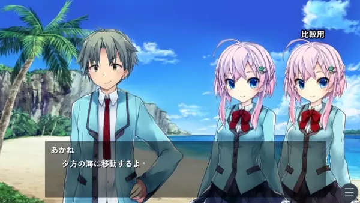

# 環境光プラグイン『ambient_light』

【名称】環境光プラグイン『ambient_light』  
【種別】ティラノスクリプト用プラグイン  
【開発環境】Windows 10 64bit OS  
【製作者】荻原(おぎはら)  
【連絡先】https://twitter.com/ogihara88sai  
【バージョン】1.0.2  
【最終更新日】2022.07.21 19:11:12  
【動作デモ】https://ogihara88sai.github.io/tsp-ambient-light/latest/  
【ダウンロード】https://github.com/ogihara88sai/tsp-ambient-light/releases  
【ライセンス】MIT

Copyright (c) 2022 荻原  
Released under the MIT license  
https://opensource.org/licenses/mit-license.php

---

## 概要



【注意】現在このプラグインは iOS および Safari 環境に対応していません。iOS や Safari でこのプラグインを読み込んだ場合、環境光は無効化されます。（環境光の効果が得られなくなるだけで、その他のスクリプトは通常通り動作します）

キャラに環境光を当てて背景に溶け込ませることができるプラグインです。

`[bg]`タグに連動して自動で環境光が更新されます。（便利！）

基本的には、`first.ks`に`[plugin name="ambient_light"]`を書いてプラグインを読み込んで、`make.ks`に`[ambient_light_restore]`を追記するだけで機能します。

ただし、`[bg]`以外のタグにも連動させたい場合や環境光の手動調整をおこないたい場合にはひと手間必要です。この説明書やサンプルシナリオを活用してカスタマイズにチャレンジしてみてください。

バグ報告や機能要望については、Twitter の DM または GitHub の Issue にてお知らせくださいませ。

---

## ファイル構成

```
ambient_light
├ init.ks
├ main.js
├ __example.ks
└ __readme.txt
```

---

## 導入方法

zip ファイルを展開して出てきた`ambient_light`フォルダを  
ティラノスクリプトのプロジェクトフォルダの`data/others/plugin/`下に配置してください。  
その後`first.ks`等に以下のタグを記述してください。

```
[plugin name="ambient_light"]
```

ティラノスクリプトのバージョンが V514 以前（V514 を含む）の場合は、`make.ks`の[return]よりも前に次のタグを追加してください。

```
[ambient_light_restore]
```

---

## 注意点

- CSS の filter プロパティを利用して環境光を当てているため、環境光の対象に[filter]タグを使ってフィルターをかけると環境光が無効化されます。

---

## 他プラグインとの競合

- [bg]タグの内部を直接書き変えるようなプラグインを環境光プラグインよりもあとに読み込むと、[bg]に連動した環境光の自動更新が機能しなくなります。

---

## プラグインを[plugin]タグで読む込むときに指定できるパラメータ

すべて省略しても動作します。

ただし、横幅サイズや高さサイズの大きなキャラ画像素材を使っている場合には width、height パラメータを指定してください。width、height を指定してあげないと画像が正常に表示されない場合があります。

デフォルトでは[bg]タグに連動して自動で環境光が更新されますが、[bg]以外の独自の背景変更タグ（たとえば[my_bg]）にも連動させたい場合は、link パラメータを"bg, my_bg"のように指定してください。環境光が正常に更新されるようにするためには、連動させたいタグの storage パラメータに画像（bgimage 基準）が指定されている必要があります。

| パラメータ | 説明                                                                                                                                                                                                                                                   |
| ---------- | ------------------------------------------------------------------------------------------------------------------------------------------------------------------------------------------------------------------------------------------------------ |
| width      | フィルタの横方向の適用範囲。基本的に省略してＯＫですが、1000px よりも横幅の大きいキャラ画像を使用している場合はそれに合わせた値を指定してください。                                                                                                    |
| height     | フィルタの縦方向の適用範囲。基本的に省略してＯＫですが、2000px よりも高さの大きいキャラ画像を使用している場合はそれに合わせた値を指定してください。                                                                                                    |
| link       | 環境光の更新を連動させるタグを指定します。デフォルトは"bg"で、これは[bg]タグによる背景変更に連動させて自動で環境光を更新していくことを意味します。たとえば[bg]だけでなく[bg2]にも連動させたい場合は"bg, bg2"のように指定してください。（カンマ区切り） |

---

## タグリファレンス

環境光プラグインを読み込むと、以下のタグが新しく使えるようになります。

- [ambient_light_config]
- [ambient_light]
- [ambient_light_def]
- [ambient_light_def_del]
- [ambient_light_restore]

### [ambient_light_config] 環境光の全般的な設定

環境光に関する全般的な設定をおこなうタグです。省略したパラメータについては設定の変更はおこなわれません。

環境光が強すぎると感じる場合は hard_light="false" がオススメです。

| パラメータ     | 説明                                                                                                                                                                                       |
| -------------- | ------------------------------------------------------------------------------------------------------------------------------------------------------------------------------------------ |
| auto           | [bg]タグなどに連動しておこなわれる環境光の自動更新を有効にするかどうか。初期値は`true`。`false`を指定すると環境光の自動更新をオフにできます。                                              |
| shadow         | デフォルトで逆光を有効にするかどうか。初期値は`true`。`false`を指定すると無効になり、逆光が表示されなくなります。                                                                          |
| shadow_size    | デフォルトの逆光のサイズ。初期値は`16`です。                                                                                                                                               |
| shadow_opacity | デフォルトの逆光の不透明度。`0.0 ～ 1.0`で指定します。初期値は`0.3`です。                                                                                                                  |
| hard_light     | ハードライトを有効にするかどうか。初期値は`true`。`false`を指定するとハードライトが無効になり、暗い背景のときでもキャラがあまり暗くならなくなります。                                      |
| name           | 環境光をキャラ以外の画像にも適用したい場合に指定します。このタグを通過する時点で該当要素が表示されていなくても使用可能です。一度指定しておけば、その要素が永久に環境光適用対象になります。 |

### [ambient_light] 環境光の更新

環境光を手動で変更します。

storage パラメータに画像を指定するか、color パラメータに色を直接指定するかのどちらかによって環境光を変化させることができます。

name パラメータを指定することで現在画面上に出ているキャラ以外の要素に環境光を当てる機能もあります。

| パラメータ     | 説明                                                                                                                                                                                                                                                         |
| -------------- | ------------------------------------------------------------------------------------------------------------------------------------------------------------------------------------------------------------------------------------------------------------ |
| time           | ミリ秒単位の数値を指定することでフェード処理できます。                                                                                                                                                                                                       |
| storage        | 画像を使って環境光を更新したい場合に画像ファイルの場所を指定します。画像は bgimage から探します。                                                                                                                                                            |
| color          | 画像を使わずに環境光の色を直接指定したい場合にはこちらのパラメータを利用できます。`0xFFFFFF`、`#FFFFFF`、`rgb(255,255,255)`のどれかの形式で指定してください。`white`のようなカラーコードには対応しません。環境光なしにしたい場合は`none`と指定してください。 |
| mode           | 合成方法を指定します。`soft-light`か`hard-light`がオススメ。`screen`や`multiply`なども使えます。                                                                                                                                                             |
| shadow         | 逆光を有効にするかどうか。`false`を指定すると無効になります。                                                                                                                                                                                                |
| shadow_color   | 逆光の色。                                                                                                                                                                                                                                                   |
| shadow_size    | 逆光のサイズ。デフォルトは`16`です。                                                                                                                                                                                                                         |
| shadow_opacity | 逆光の不透明度。`0.0 ～ 1.0`で指定します。デフォルトは`0.3`です。                                                                                                                                                                                            |
| name           | 環境光をキャラ以外の画像にも適用したい場合に指定します。name 以外のパラメータは省略してＯＫです。                                                                                                                                                            |

### [ambient_light_def] 特定画像の環境光の定義

特定の画像の環境光の色を直接定義することができます。storage パラメータと color パラメータが必須。

自動調整で決定される環境光がイマイチな場合はこちらのタグで定義してあげてください。一度定義すれば、その画像を背景に出したときには常にその環境光設定が使われるようになります。

このタグで定義した環境光を削除するには[ambient_light_def_del]タグを使用してください。

また、このタグで定義を環境光設定を"使い捨て"にする（1 回この定義を使ったら自動で定義を削除する）ようにするためには、once パラメータに true を指定してください。

| パラメータ     | 説明                                                                                                                                                                                   |
| -------------- | -------------------------------------------------------------------------------------------------------------------------------------------------------------------------------------- |
| storage        | 画像ファイルのパス。bgimage から探します。                                                                                                                                             |
| color          | 環境光の色。`0xFFFFFF`、`#FFFFFF`、`rgb(255,255,255)`のどれかの形式で指定してください。`white`のようなカラーコードには対応しません。環境光なしにしたい場合は`none`と指定してください。 |
| mode           | 合成方法を指定します。`soft-light`か`hard-light`がオススメ。`screen`や`multiply`なども使えます。                                                                                       |
| shadow         | 逆光を有効にするかどうか。`false`を指定すると無効になります。                                                                                                                          |
| shadow_color   | 逆光の色。                                                                                                                                                                             |
| shadow_size    | 逆光のサイズ。デフォルトは`16`です。                                                                                                                                                   |
| shadow_opacity | 逆光の不透明度。`0.0 ～ 1.0`で指定します。デフォルトは`0.3`です。                                                                                                                      |
| once           | `true`を指定しておくと、この定義を１回こっきりの使い捨て定義にできます。[ambient_light_def_del]を書く手間を省けます。                                                                  |

### [ambient_light_def_del] 環境光の設定

[ambient_light]で定義した環境光の設定を削除します。

| パラメータ | 説明                                  |
| ---------- | ------------------------------------- |
| storage    | 定義を削除する storage を指定します。 |

### [ambient_light_restore] 環境光の復元

セーブ時の環境光を復元するために、`make.ks`にこのタグを記述する必要があります。

指定できるパラメータはありません。

---

## 更新履歴

### v1.0.0

公開。

#### v1.0.1

- iOS および Mac のブラウザ環境ではこのプラグインの機能を無効化するように変更しました（iOS および Mac のブラウザがサポートしていない技術を使用しているため）。環境光の効果はなくなりますが、その他のスクリプトは通常通り動作します。

#### v1.0.2

- v1.0.1 で Mac を一律で非サポートと判定していましたが、Mac においても Chrome なら動作可能との報告を受けましたので（ダメなのは Safari）、「iOS および Safari」でプラグインを無効化する仕様に変更しました。
